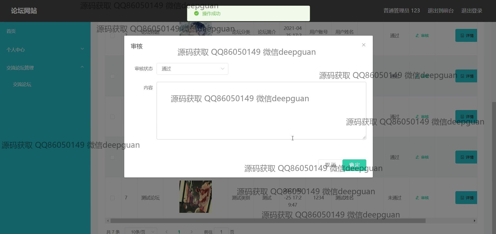
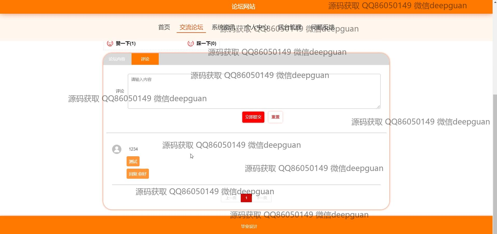

<h1 align="center">基于的论坛网站</h1>

## 简介
Spring Boot论坛网站：用户角色包括管理员和普通用户。主要功能有用户注册、登录、发帖评论、论坛管理、后台管理及问题反馈。简洁明了的界面提升用户体验和社区互动性，适合作为毕业设计项目。    --计算机毕业设计源码；毕设源码；java毕业设计源码

## 联系方式

<h3 align="center">获取完整代码与数据库文件 + 微信：deepguan QQ: 86050149 QQ群: 783742310</h3>

<h3 align="center">可帮忙远程部署 包运行成功！提供远程部署、修改代码、设计文档指导、代码讲解等服务！</h3>

## 功能介绍（完整见运行截图）
管理员：管理员具备的核心功能包括登录、注册和退出登录。管理员可以访问网站首页，通过主导航栏进入各类管理功能，涉及论坛类别管理、用户管理、普通管理员管理、系统管理等模块。界面功能还支持论坛帖子审核、用户评论管理、轮播图管理及问题反馈的接收和处理，确保平台内容和用户交流的规范化。管理员可以使用姓名、性别、联系电话等信息对个人资料进行管理，并通过修改密码功能加强账户安全。

用户：用户在该论坛网站同样可以进行登录和注册操作。登录后，用户可以通过导航栏访问个人中心，进行个人信息的查看和修改，如账户信息、联系方式和个人头像的上传。用户还可以浏览论坛板块，发帖、回复和评论其他帖子，并参与点赞、点踩互动，借此增强论坛内的交流与互动。用户注册后，可以在“个人中心”管理自己的收藏帖子和文章，并通过反馈对话框向网站提供意见和建议。

## 运行截图

本代码来源于网络,仅供学习参考使用!

